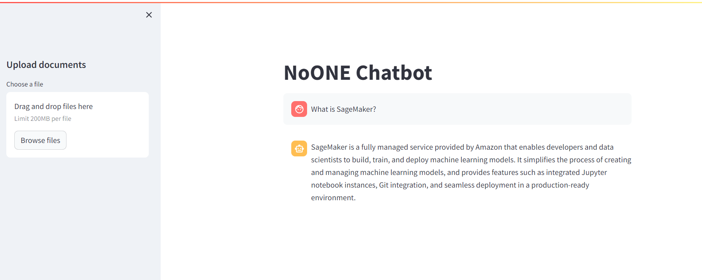
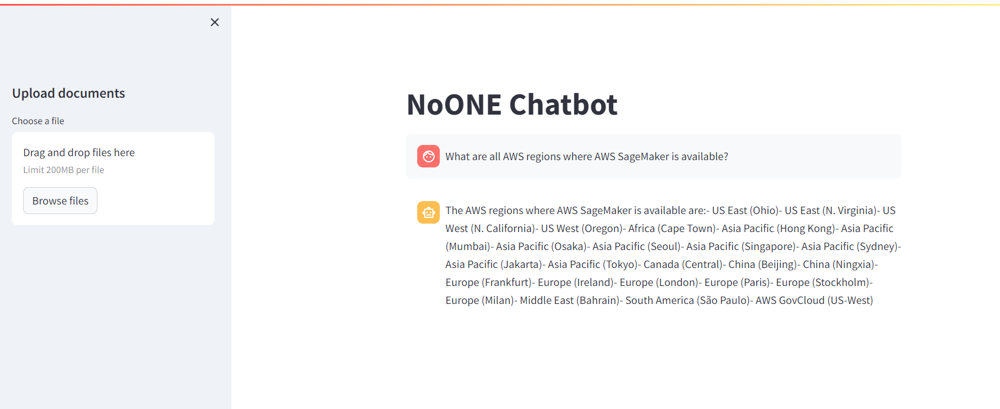
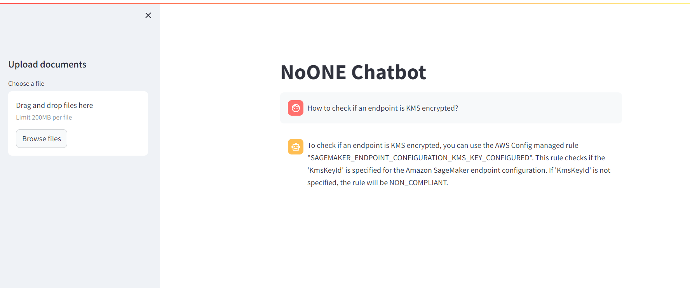
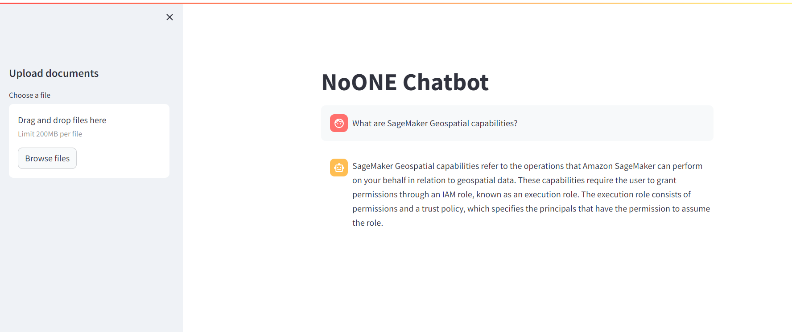
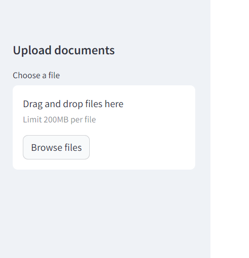
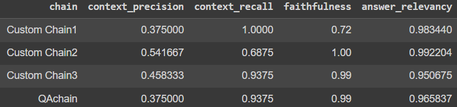

# NoONE Langchain Chatbot 🦜️🔗

NoONE Chatbot is a chatbot prototype designed for question-answering with custom information. It works as an API service for creating custom vector stores and answering questions. The architecture follows a microservices design.

## Features ✅

### 1. Chatbot Service

- **Python-based API**: Provides a Python-based API for virtual assistant question-answering using FastAPI.
- **Question Answering (POST Endpoint)**: Utilizes a chain for question and answer
- **Vectorstore creation (GET Endpoint)**: Update and creation of the vectorstore

### 2. Redis

- **In-memory data store**: For vectorstore and mamory data store

### 3. Frontend

- **Chatbot**: example of Chatbot Service Streaming Response usage with streamlit

## Question Answering examples

1. What is SageMaker?



2. What are all AWS regions where AWS SageMaker is available?



3. How to check if an endpoint is KMS encrypted?



4. What are SageMaker Geospatial capabilities?



## How to update the vectorstore

In this case, we must upload all the updated .md files


## Evaluating RAG solution ✅

When assessing the performance of a RAG (Retrieval-Augmented Generation) chatbot, various options are available, including RAGAs, RAG triad of metrics, ROUGE, and more. In this particular case, the focus is on RAGAs, which encompasses the following key metrics:

- Answer relevance: Evaluates the extent to which the provided answers address the specific queries
- Context relevance: Examines the importance of contextual information in responding to queries
- Faithfulness: Gauges the coherence and alignment of the generated answers with the generated chunks.

### Questions to evaluate

To illustrate the evaluation process, the following sample questions have been chosen:

1. What is SageMaker?
2. What are all AWS regions where AWS SageMaker is available?
3. How to check if an endpoint is KMS encrypted?
4. What are SageMaker Geospatial capabilities?

### Results



In this brief comparison of chatbots, opting for Custom Chain3 (with a chunk size of 2000) emerges as a favorable choice due to its consistently higher scores across all metrics. However, it is essential to emphasize that our journey doesn't end here; continuous iteration is crucial. Integrating tools such as mlflow for score tracking will further enhance our ability to monitor and refine the performance of our LLM solution, comparing more variables like temperature, chunk_size, chunk_overlap, k numbers of chunks retrieved, and also testing advance RAG solutions like Sentence Window Retrieval, or Auto-Merging Retrieval.

## Running project locally ✅

To run the chatbot, follow these steps:

1. Obtain an API key from OpenAI "OPENAI_API_KEY" and save it in a `credentials.env` file.
2. Run the following Docker Compose command, specifying the environment file: `docker-compose --env-file credentials.env up`
3. Access the chatbot interface by opening [localhost:8501](http://localhost:8501) in your web browser.

## Running project on EC2 ✅

### 1. Create IAM user

### 2. Create EC2 instance: can be ubuntu

### 3. Setup EC2 instance

```
#optinal

sudo apt-get update -y

sudo apt-get upgrade

#required

curl -fsSL https://get.docker.com -o get-docker.sh

sudo sh get-docker.sh

sudo usermod -aG docker ubuntu

newgrp docker

#In case of error
sudo chmod 666 /var/run/docker.sock

```

### 4. Create a runner in github

#### Download

```
mkdir actions-runner && cd actions-runner # Download the latest runner package
curl -o actions-runner-linux-x64-2.313.0.tar.gz -L https://github.com/actions/runner/releases/download/v2.313.0/actions-runner-linux-x64-2.313.0.tar.gz
echo "56910d6628b41f99d9a1c5fe9df54981ad5d8c9e42fc14899dcc177e222e71c4 actions-runner-linux-x64-2.313.0.tar.gz" | shasum -a 256 -c
tar xzf ./actions-runner-linux-x64-2.313.0.tar.gz
```

#### Configure

#### Create the runner and start the configuration experience

```
./config.sh --url https://github.com/luis95garay/data_science_bank_churn --token A2HZ3RAIEHR54EP7JI4PWY3F2JIFM
./run.sh
```

#### Using your self-hosted runner: The name must be self-hosted

### 7. Create github credentials

```
AWS_REGION = us-east-1

OPENAI_API_KEY = ""

AWS_ACCESS_KEY_ID = ""

AWS_SECRET_ACCESS_KEY = ""

BUCKET_NAME = ""
```

### 7. Add and push the github workflow

### 8. Update security group

- Add custom TCP in port 8501

### 9. Clean resources

- Delete app runner
- Terminate EC2
- Delete ECR repository
